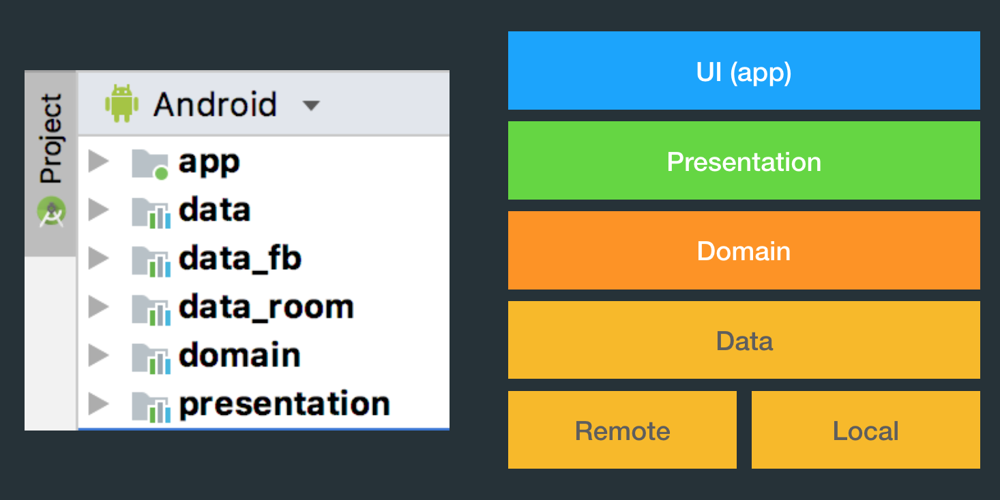
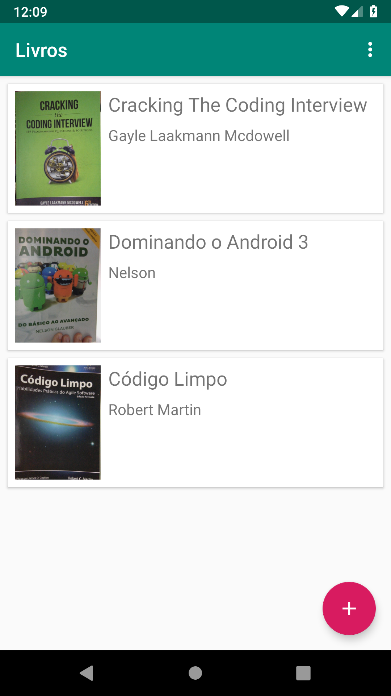
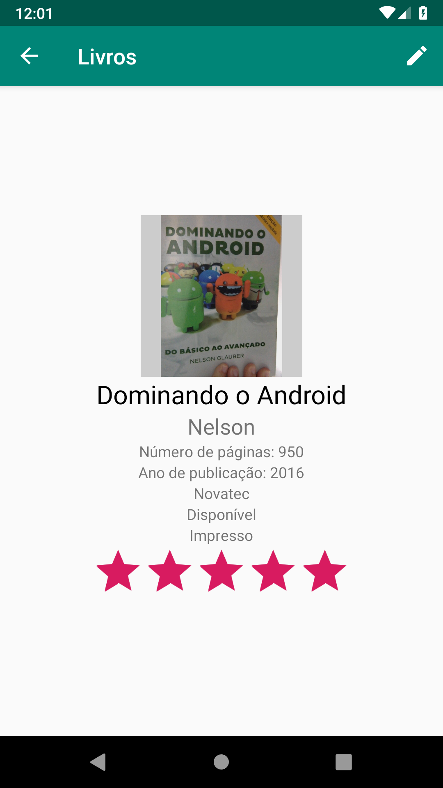
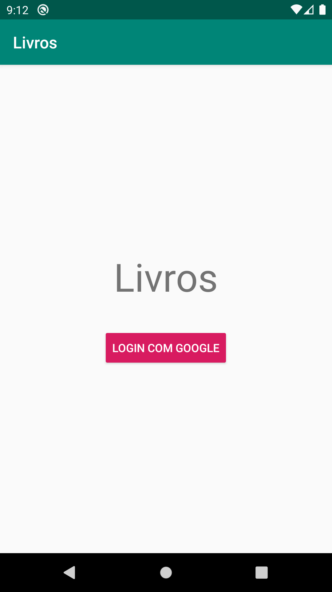

# Books Jetpack
This sample demonstrates how to use some of the Android Architecture Components available in  [Jetpack library](https://developer.android.com/jetpack/).

In this sample I tried to follow the [Clean Architecture](https://8thlight.com/blog/uncle-bob/2012/08/13/the-clean-architecture.html) principles and use some cool Android libraries.

The Application is divided in modules as displayed below:



* __UI__ - contains all UI related classes (Activities, Fragments, Adapters, etc.). <br/>
The authentication process is also implemented here (I need to improve that) using [Firebase Authentication](https://firebase.google.com/docs/auth).<br/>
This layer is using Jetpack's [Navigation API](https://developer.android.com/topic/libraries/architecture/navigation.html) to implement the "single activity" approach for the navigation flow.
* __Presentation__ - once this project is folowing (or trying to) the [MVVM pattern](https://en.wikipedia.org/wiki/Model%E2%80%93view%E2%80%93viewmodel), this layer is using [View Model](https://developer.android.com/topic/libraries/architecture/viewmodel) library to keep data between config changes.<br/>
To expose observable data from the View Models, this module is using [LiveData](https://developer.android.com/topic/libraries/architecture/livedata).<br/>
This layer is using [Lifecycle library](https://developer.android.com/topic/libraries/architecture/lifecycle) in order to tie the View Model with UI lifecycle (in some cases).<br/>
Finally, this module is also using [Data Binding](https://developer.android.com/topic/libraries/data-binding/) to keep the data in sync during user input.
* __Domain__ - in this module are declared the application's use cases.
* __Data__ - declares the basic operations that must be provided by the application's repository and the basic data classes used as [DTO](https://en.wikipedia.org/wiki/Data_transfer_object).
* __Data Remote__ - contains a implementation of a remote data source using [Firebase Cloud Firestore](https://firebase.google.com/docs/firestore). The book's cover are stored in the [Firebase Cloud Storage](https://firebase.google.com/docs/storage).
* __Data Local__ - contains a implementation of a local data source [Room library](https://developer.android.com/topic/libraries/architecture/room). The book's cover are stored in the local file system.

## Screenshots
### Books List
This screen displays all books saved on the repository (local or remote).



### Book details
This screen display the details of a book selected in books list.



### Book Form
In this screen, the user can add a new book or edit an existing one.


### Login Screen
The user must perform the login with their Google account to access the application.



## Libraries
This project is written in Kotlin and it's using the following libraries:
* AppCompat;
* ConstraintLayout;
* Material Design Components Library;
* [Jetpack Libraries](https://developer.android.com/jetpack/) (Navigation, Data Binding, View Model, Lifecycle, LiveData and Room);
* [Firebase Libraries for Android](https://firebase.google.com/docs/android/setup) (Authentication, Firestore and Storage);
* [RXJava](https://github.com/ReactiveX/RxJava)
* [Picasso](http://square.github.io/picasso/)
* JUnit
* [Mockito](http://site.mockito.org/)

## Get started
This application were created using Android 3.3 Beta 3.
To run this application, you must have to [create a Firebase Project](https://firebase.google.com/docs/android/setup) and [enable Google Authentication](https://firebase.google.com/docs/auth/android/google-signin).
If you want to save data on Firebase Cloud Firestore, [enable this database](https://firebase.google.com/docs/firestore/quickstart) for your project in Firebase Console. Also [enable the Firebase Cloud Storage](https://firebase.google.com/docs/storage/android/start).

To choose the repository to save applications data, just make the following change in the [BookVmFactory.kt](./presentation/src/main/java/dominando/android/presentation/BookVmFactory.kt) file.
```kotlin
// Use either of the lines below

// Remote repository with Firebase
val repo = FbRepository()
// Local repository with Room + SQLite
val repo = RoomRepository(AppDatabase.getDatabase(application), LocalFileHelper())
```
And that's it! You're good to go.


## Contribute ;)

This project is just a demo, but any feedback and/or PR's are appreciated! :)